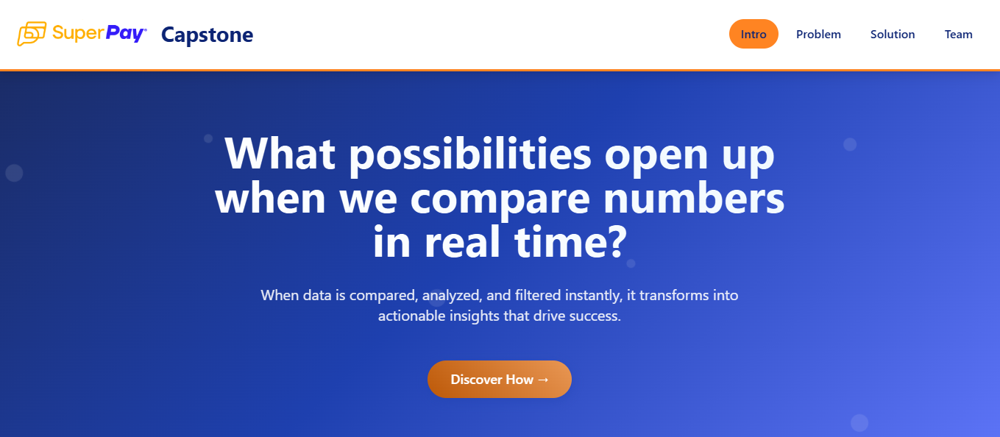

# Capston‑Website — SuperPay Project Presentation

## Overview

This repository contains a web-based presentation of the SuperPay dashboard project, built to showcase the main aspects of our solution in a visual and interactive format. Instead of using a slide deck, I developed this responsive web app to present the project in a more engaging and modern way.

## How it looks:

Open the following link https://macfe1.github.io/capston-website/



## What This Presentation Shows

The web illustrates the following key points:

- 🧩 The Problem SuperPay was facing

- 💡 The Solution our team developed

- 🚀 The Impact the solution had.


## Tech Stack

This presentation web was built using:

- HTML

- CSS

- Tailwind CSS

- JavaScript


## Project Structure

```bash
capston-website/
├── index.html        # Presentation layout and content
├── index.js          # Simulated logic and interactivity
├── index.css         # Styling for layout and responsiveness
└── Capston-img/      # Image assets used in the presentation
```

## How to View the Presentation

Open the following link https://macfe1.github.io/capston-website/
